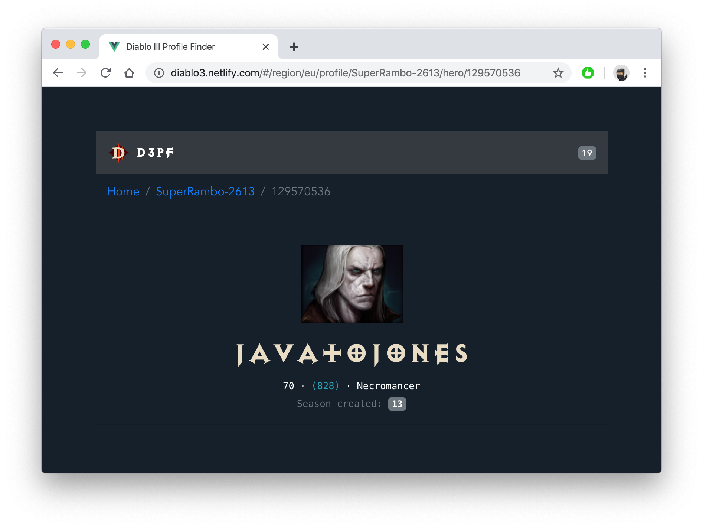

# Diablo 3 Profile Finder
<!-- ALL-CONTRIBUTORS-BADGE:START - Do not remove or modify this section -->
[](#contributors-)
<!-- ALL-CONTRIBUTORS-BADGE:END -->


## Jorge Baumann 🔥

Senior full-stack developer.  
Software engineer 👨‍💻 and content creator 🦄. Passionate about Open Source and communities.

### https://baumannzone.dev

[](https://youtube.com/c/RambitoJS)


- Instagram: https://instagram.com/baumannzone
- Twitter: https://twitter.com/baumannzone
- Twitch: https://twitch.tv/baumannzone
- Youtube: https://youtube.com/c/RambitoJS

---

# 👾 D3PF. Vue.js course repository

[D3PF](https://diablo3-vue.vercel.app/): Learn Vue.js with this app created from scratch through [Vue CLI](https://cli.vuejs.org/) that consume official Diablo III APIs, a Blizzard's game.

## App Live Demo
👉 https://diablo3-vue.vercel.app/

> - User: `MADman#2102`
> - Region: `EU`

---
[](https://github.com/baumannzone/diablo3-vue-platzi/actions)


[](./LICENSE)




---

## Project setup
```markdown
# Install
yarn install

# Compiles and hot-reloads for development
yarn serve

# Compiles and minifies for production
yarn build

# Run your unit tests
yarn test:unit

# Run your end-to-end tests
yarn test:e2e

# Lints and fixes files
yarn lint
```

---


## Contributors ✨

Thanks goes to these wonderful people ([emoji key](https://allcontributors.org/docs/en/emoji-key)):

<!-- ALL-CONTRIBUTORS-LIST:START - Do not remove or modify this section -->
<!-- prettier-ignore-start -->
<!-- markdownlint-disable -->
<table>
  <tbody>
    <tr>
      <td align="center" valign="top" width="14.28%"><a href="https://twitter.com/baumannzone"><br /><sub><b>Jorge Baumann</b></sub></a><br /><a href="https://github.com/baumannzone/diablo3-vue-platzi/commits?author=baumannzone" title="Code">💻</a> <a href="#maintenance-baumannzone" title="Maintenance">🚧</a> <a href="https://github.com/baumannzone/diablo3-vue-platzi/commits?author=baumannzone" title="Tests">⚠️</a> <a href="#design-baumannzone" title="Design">🎨</a> <a href="https://github.com/baumannzone/diablo3-vue-platzi/commits?author=baumannzone" title="Documentation">📖</a> <a href="#infra-baumannzone" title="Infrastructure (Hosting, Build-Tools, etc)">🚇</a></td>
      <td align="center" valign="top" width="14.28%"><a href="https://github.com/ludmartinez"><br /><sub><b>Diego Martínez</b></sub></a><br /><a href="https://github.com/baumannzone/diablo3-vue-platzi/commits?author=ludmartinez" title="Code">💻</a></td>
      <td align="center" valign="top" width="14.28%"><a href="http://linkedin.com/in/angel-cabrera/"><br /><sub><b>Angel Cabrera</b></sub></a><br /><a href="https://github.com/baumannzone/diablo3-vue-platzi/commits?author=AngelCabrera" title="Code">💻</a></td>
      <td align="center" valign="top" width="14.28%"><a href="https://github.com/alexanderjanke"><br /><sub><b>Alexander Janke</b></sub></a><br /><a href="https://github.com/baumannzone/diablo3-vue-platzi/commits?author=alexanderjanke" title="Code">💻</a></td>
      <td align="center" valign="top" width="14.28%"><a href="https://github.com/dmunoz-10"><br /><sub><b>Daniel Muñoz</b></sub></a><br /><a href="https://github.com/baumannzone/diablo3-vue-platzi/commits?author=dmunoz-10" title="Code">💻</a> <a href="#infra-dmunoz-10" title="Infrastructure (Hosting, Build-Tools, etc)">🚇</a></td>
      <td align="center" valign="top" width="14.28%"><a href="https://www.facebook.com/RetaxMaster/"><br /><sub><b>RetaxMaster</b></sub></a><br /><a href="https://github.com/baumannzone/diablo3-vue-platzi/commits?author=RetaxMaster" title="Code">💻</a></td>
      <td align="center" valign="top" width="14.28%"><a href="https://github.com/carlosmperilla"><br /><sub><b>carlosmperilla</b></sub></a><br /><a href="https://github.com/baumannzone/diablo3-vue-platzi/commits?author=carlosmperilla" title="Code">💻</a></td>
    </tr>
  </tbody>
</table>

<!-- markdownlint-restore -->
<!-- prettier-ignore-end -->

<!-- ALL-CONTRIBUTORS-LIST:END -->

This project follows the [all-contributors](https://github.com/all-contributors/all-contributors) specification. Contributions of any kind welcome!
